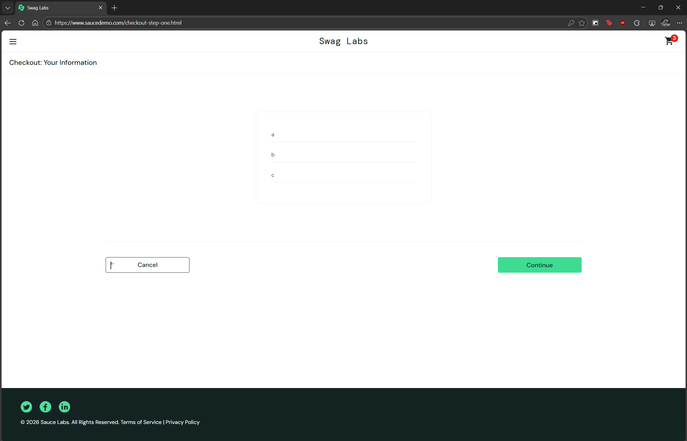

# BUG-003 — Postal Code Field Accepts Non-Numeric Values

## General Information
| Field | Detail |
|-------|--------|
| ID | BUG-003 |
| Date | 2026-02-22 |
| Reported by | Rodrigo Flores Agreda |
| Severity | Medium |
| Priority | Medium |
| Status | Open |
| Related TC | TC-019 |

## Description
The Postal Code field in the checkout form does not validate that the 
entered value is numeric, allowing the purchase to be completed with 
arbitrary text.

## Steps to Reproduce
1. Navigate to https://www.saucedemo.com
2. Log in with standard_user / secret_sauce
3. Add any product to the cart
4. Go to cart and click "Checkout"
5. Fill in First Name and Last Name with any value
6. Enter text (e.g.: "abcde") in the Postal Code field
7. Click "Continue"

## Expected Result
The system should display an error indicating that the Postal Code 
must contain numeric values only.

## Actual Result
The purchase proceeds without any error and completes successfully.

## Impact
Invalid data could be stored in the database, causing issues in 
logistics or shipping processes that depend on the postal code.

## Note
In some countries postal codes include letters (e.g.: Canada, UK).
If the app operates in those markets, this behavior may be intentional.
It is recommended to clarify the requirement with the product team.

## Environment
| Field | Detail |
|-------|--------|
| Browser | Edge |
| OS | Windows 10 |
| URL | https://www.saucedemo.com/checkout-step-one.html |

## Evidence

