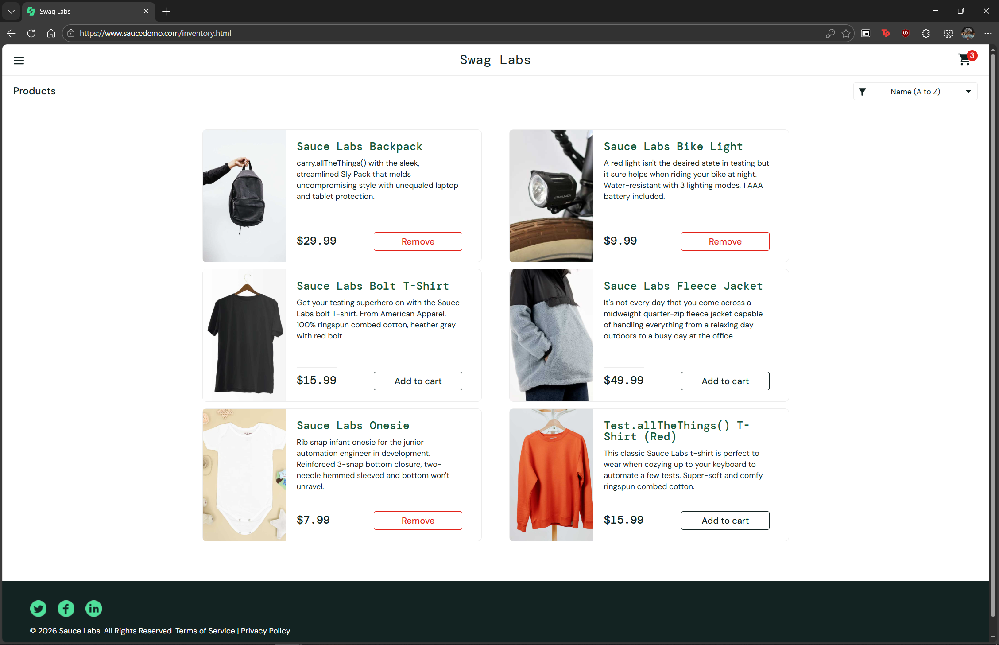

# BUG-005 — Remove Button Unresponsive from Inventory and Individual Product Page with error_user

## General Information
| Field | Detail |
|-------|--------|
| ID | BUG-005 |
| Date | 2026-02-22 |
| Reported by | Rodrigo Flores Agreda |
| Severity | High |
| Priority | High |
| Status | Open |
| Related TC | TC-015, TC-016 |

## Description
With error_user, the "Remove" button does not respond from the inventory 
page or from each product's individual page. Products cannot be removed 
from the cart from those locations.

## Steps to Reproduce
1. Log in with error_user / secret_sauce
2. Add a product to the cart
3. Click "Remove" from the inventory page
4. Verify if the product was removed
5. Repeat from the individual product page

## Expected Result
The product should be removed from the cart and the counter should update.

## Actual Result
The "Remove" button does not respond in either context.
The product remains in the cart and the counter does not change.

## Impact
The user cannot manage their cart correctly, forcing them to navigate 
to the cart page to remove products, which interrupts the natural 
shopping flow.

## Environment
| Field | Detail |
|-------|--------|
| Browser | Edge |
| OS | Windows 10 |
| URL | https://www.saucedemo.com/inventory.html |

## Evidence

