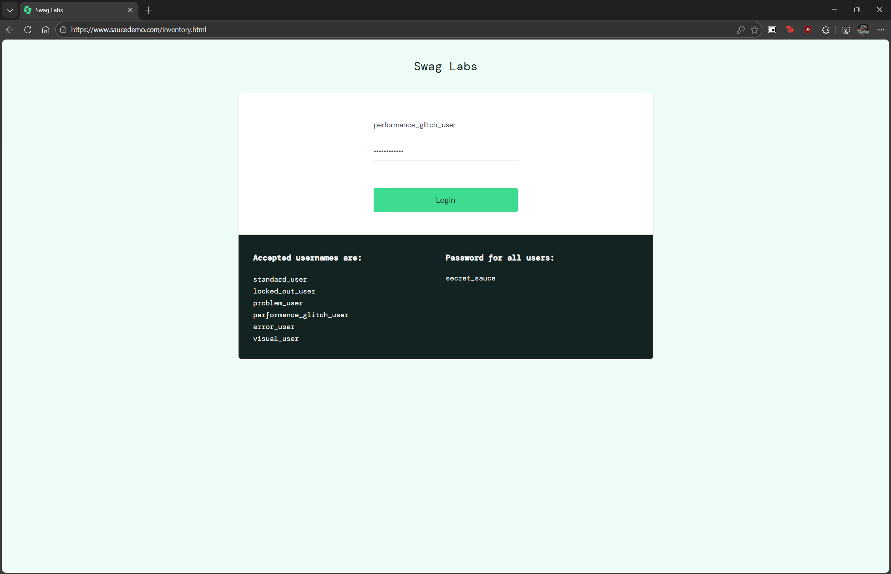

# BUG-001 — Botón de login sin feedback visual durante autenticación lenta

## Información general
| Campo | Detalle |
|-------|---------|
| ID | BUG-001 |
| Fecha | 2026-02-22 |
| Reportado por | Rodrigo Flores Agreda |
| Severidad | Baja |
| Prioridad | Media |
| Estado | Abierto |
| TC relacionado | TC-006 |

## Descripción
El botón de login no muestra ningún indicador visual de carga durante el proceso 
de autenticación con el usuario `performance_glitch_user`. El usuario no recibe 
feedback de que el sistema está procesando su solicitud.

## Pasos para reproducir
1. Ingresar a https://www.saucedemo.com
2. Ingresar usuario: `performance_glitch_user`
3. Ingresar contraseña: `secret_sauce`
4. Hacer click en el botón "Login"
5. Observar el comportamiento del botón durante la espera

## Resultado esperado
El botón debería mostrar un estado de carga (spinner, texto "Cargando...", 
o deshabilitarse) mientras el sistema procesa la autenticación.

## Resultado obtenido
El botón permanece igual visualmente durante aproximadamente 3-5 segundos 
sin ningún cambio de estado, generando incertidumbre sobre si el sistema 
está respondiendo.

## Impacto
El usuario podría hacer click múltiples veces creyendo que el primero 
no fue registrado, generando solicitudes duplicadas.

## Entorno
| Campo | Detalle |
|-------|---------|
| Navegador | Edge |
| SO | Windows 10 |
| URL | https://www.saucedemo.com |

## Evidencia

