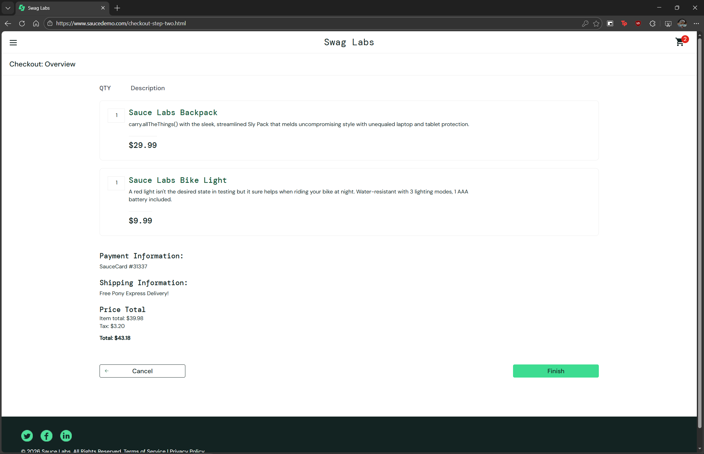

# BUG-007 — Checkout avanza con campo Last Name vacío con error_user

## Información general
| Campo | Detalle |
|-------|---------|
| ID | BUG-007 |
| Fecha | 2026-02-22 |
| Reportado por | Rodrigo Flores Agreda |
| Severidad | Alta |
| Prioridad | Alta |
| Estado | Abierto |
| TC relacionado | TC-021 |

## Descripción
Con error_user, el sistema permite avanzar en el checkout con el campo 
Last Name vacío, sin mostrar ningún mensaje de error, a pesar de que 
este campo es requerido para otros usuarios.

## Pasos para reproducir
1. Login con error_user / secret_sauce
2. Agregar cualquier producto al carrito
3. Ir al carrito y click en "Checkout"
4. Completar First Name y Postal Code
5. Dejar Last Name vacío (o intentar escribir y verificar que queda vacío)
6. Click en "Continue"

## Resultado esperado
El sistema debería mostrar un error: "Last Name is required" 
e impedir avanzar hasta completar el campo.

## Resultado obtenido
El sistema avanza al siguiente paso del checkout sin mostrar 
ningún error de validación.

## Impacto
Pedidos con datos incompletos podrían procesarse en el sistema, 
generando problemas operativos y de envío.

## Entorno
| Campo | Detalle |
|-------|---------|
| Navegador | Edge |
| SO | Windows 10 |
| URL | https://www.saucedemo.com/checkout-step-one.html |

## Evidencia

